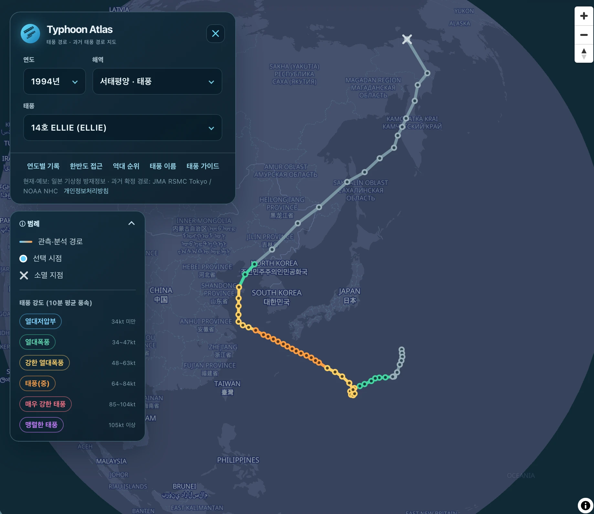
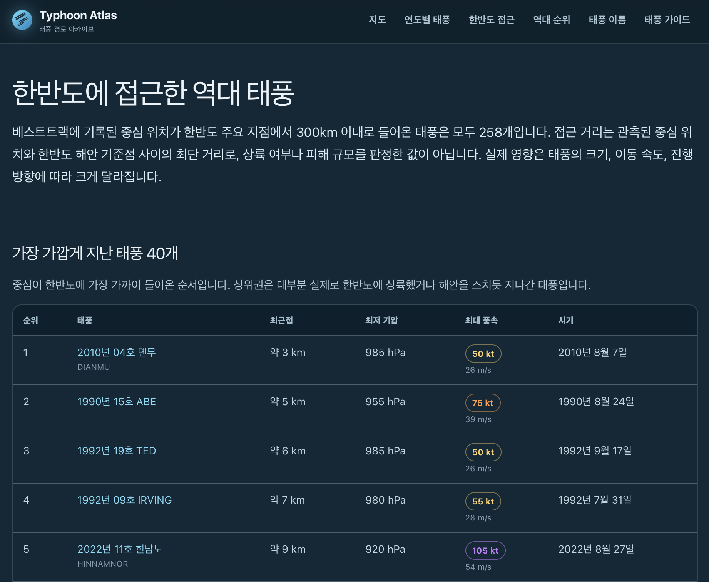

# Typhoon Atlas

전 세계 태풍·허리케인·사이클론의 과거 경로와 현재 예보를 지도에서 탐색하는 웹 앱입니다.




## 주요 기능

- 연도·해역·태풍 선택으로 과거 경로 탐색
- 전 세계 열대저기압 경로와 현재 예보 표시
- 풍속 등급에 따라 색이 바뀌는 경로선으로 태풍의 발달·쇠퇴 과정을 한눈에 확인
- 소멸한 태풍은 경로 끝점에 별도 표시, 진행 중인 태풍은 현재 위치를 지도 중앙에 자동 포커스
- 접고 펼 수 있는 범례 패널로 경로선·강도 색상 기준 안내
- 모바일에 대응하는 지도 중심 UI

## 태풍 기록 아카이브

지도 화면 외에도 검색엔진에서 바로 찾아볼 수 있는 정적 기록 페이지를 함께 제공합니다.



- **연도별 기록** — 1951년 이후 모든 태풍을 연도별 목록과 표로 정리
- **한반도 접근** — 한반도 300km 이내로 들어온 역대 태풍을 접근 거리순으로 정리
- **역대 순위** — 중심기압·풍속 기준 역대 최강 태풍 순위
- **태풍 이름** — 현재 쓰이는 이름과 퇴출된 이름의 사용 이력
- **태풍 가이드** — 강도 등급, 단위 환산, 예보원·강풍반경 등 용어 설명

개별 태풍마다 전체 관측 경로를 담은 상세 페이지(`/typhoon/{연도}/{슬러그}`)가 자동 생성됩니다.

## 데이터

과거 확정 경로는 JMA RSMC Tokyo와 NOAA NHC 자료를 사용하고, 현재·예보 정보는 일본 기상청 방재정보를 사용합니다.

`.github/workflows/update-storm-data.yml`이 3시간마다 공식 원본을 확인하며, 데이터가 변경된 경우에만 `public/data`와 아카이브 페이지가 참조하는 요약 인덱스(`app/data/generated`)를 함께 갱신합니다.

## 개발

Node.js 22.13 이상이 필요합니다.

```bash
npm install
npm run dev
npm run build
```

## 배포

Cloudflare Workers Builds에서 아래 명령으로 배포합니다.

```bash
npm run build
npx wrangler deploy --config dist/server/wrangler.json
```
